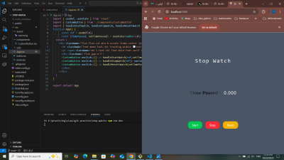

⏱️ React + TypeScript Stopwatch App
A minimalist stopwatch built with React, TypeScript, and Vite. It features start, stop, and reset functionality — ideal for exploring component state, hooks, and responsive UI design.
🚀 Tech Stack
- React (with hooks)
- TypeScript
- Vite (lightning-fast dev server)
- Tailwind CSS (utility-first styling)
- 
🧠 Core Concepts
- useState for managing timer state and control flow
- useRef to persist interval ID across renders
- Clean separation of logic and presentation
- Responsive layout with Tailwind
- 
📸 Screenshot

📦 Installation

git clone https://github.com/rasoulnasserifreelancer/stop-watch.git

cd stop-watch

npm install

npm run dev

🧪 Features
- ⏯️ Start / Stop toggle
- 🔄 Reset timer
- 📱 Responsive design
- 🧼 Clean codebase with reusable hooks

🌐 Demo on Vercel

[stop-watch](https://stop-watch-five-xi.vercel.app/)

🛠️ Scripts

| npm run dev |

| npm run build |  

| npm run preview |   

📄 License
MIT — feel free to fork, remix, and learn!

